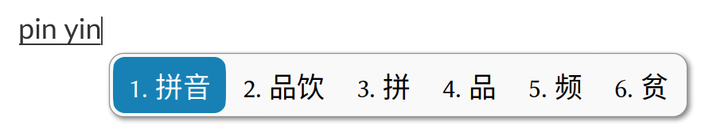

**English** | [中文](./README.md)

# fcitx5-mellow-themes

Aesthetic, modern fcitx5 theme featuring rounded rectangle design.


## What's New

- A semi-transparent, blurred input window for KWin

  

## Notice

Intended for: 

- X11, LoDPI

- Wayland, LoDPI

- Wayland, HiDPI

For users of “X11, HiDPI”, please check [fcitx5-mellow-themes-legacy](https://github.com/sanweiya/fcitx5-mellow-themes-legacy).

## Usage

### Manual Installation (for the current user)

```
git clone https://github.com/sanweiya/fcitx5-mellow-themes.git
```

```
cd fcitx5-mellow-themes/
```

Solid version:

```
mkdir -p ~/.local/share/fcitx5/themes && cp -r ./mellow* ~/.local/share/fcitx5/themes
```

Semi-transparent, blurred version: 

```
mkdir -p ~/.local/share/fcitx5/themes && cp -r ./kwinblur-mellow-* ~/.local/share/fcitx5/themes
```

Of course you can choose the parts you need to copy.

### Community Software Repository

#### Arch Linux (Outdated)

[AUR package](https://aur.archlinux.org/packages/fcitx5-mellow-themes-git) maintained by yjun.

You can use your preferred AUR helper, for example:

```
yay -S fcitx5-mellow-themes-git
```

This PKGBUILD still works, but it will only install solid version.

## Screenshots

- **Youlan 釉蓝**
  
   
  
- **Sakura 灰樱**
  
   
  
- **Vermilion 朱砂**
  
   
  
- **Wechat 微言**
  
   
  
- **Graphite 石墨**
  
   
  
- **Vertical & Dual-line**
  
   

## EOF
