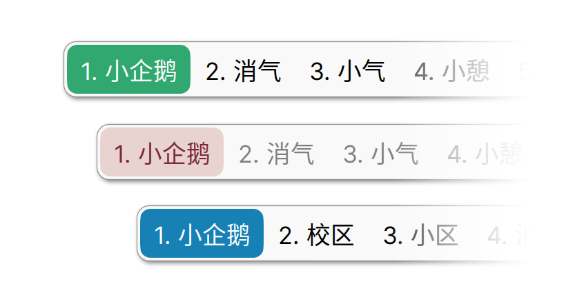
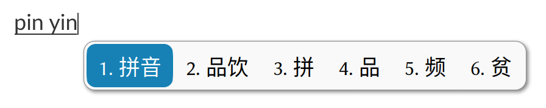
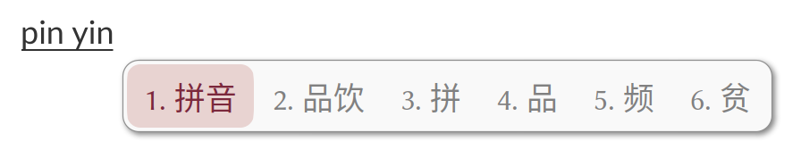
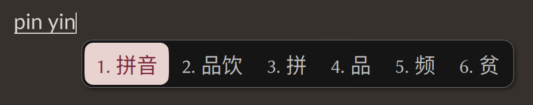
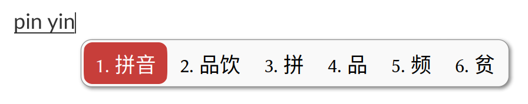
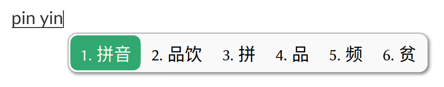
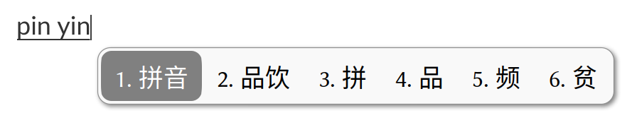
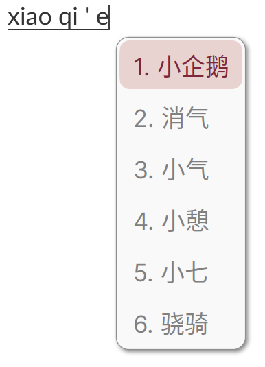
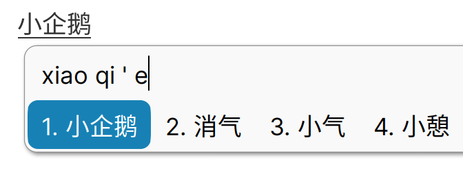

**中文** | [English](./README.en.md)

# fcitx5-mellow-themes

美观、现代的 fcitx5 主题，采用圆角矩形设计。



## 🆕 新特性

- 适用于 KWin 的输入法窗口半透明模糊

  

## 注意

适用于：

- X11, LoDPI

- Wayland, LoDPI

- Wayland, HiDPI

如果你在使用“X11, HiDPI”，请选择 [fcitx5-mellow-themes-legacy](https://github.com/sanweiya/fcitx5-mellow-themes-legacy)

## 使用方法

### 手动安装 (为当前用户) 

```
git clone https://github.com/sanweiya/fcitx5-mellow-themes.git
```

```
cd fcitx5-mellow-themes/
```

安装不透明版本: 

```
mkdir -p ~/.local/share/fcitx5/themes && cp -r ./mellow-* ~/.local/share/fcitx5/themes
```

安装 Kwin 模糊版本: 

```
mkdir -p ~/.local/share/fcitx5/themes && cp -r ./kwinblur-mellow-* ~/.local/share/fcitx5/themes
```

当然，也可以自己选择需要复制的部分。

### 社区软件源

#### ~~Arch Linux~~ 

~~[AUR package](https://aur.archlinux.org/packages/fcitx5-mellow-themes-git) maintained by yjun.~~

~~You can use your preferred AUR helper, for example:~~

```
yay -S fcitx5-mellow-themes-git
```

暂未更新

## Screenshots

- **Youlan 釉蓝**
  
   
  
- **Sakura 灰樱**
  
   
  
- **Vermilion 朱砂**
  
   
  
- **Wechat 微言**
  
   
  
- **Graphite 石墨**
  
   
  
- **Vertical & Dual-line**
  
   

## EOF
