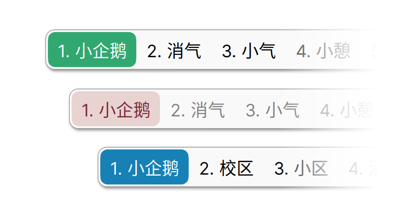
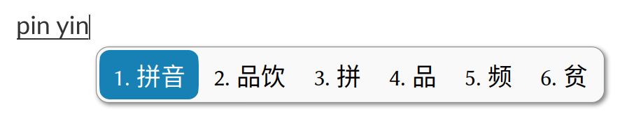
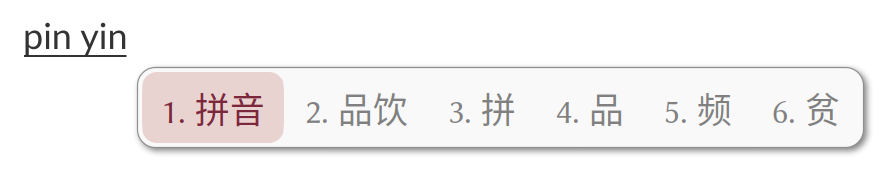
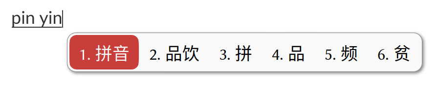
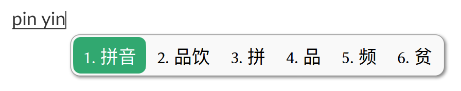
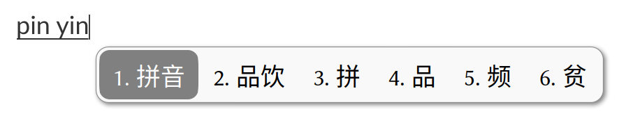
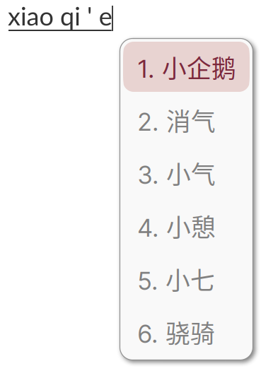
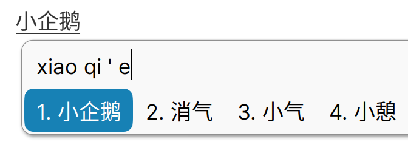

**中文** | [English](./README.en.md)

# Mellow for Fcitx5

[](https://github.com/sanweiya/fcitx5-mellow-themes/stargazers) [](https://github.com/sanweiya/fcitx5-mellow-themes/stargazers) [](https://github.com/sanweiya/fcitx5-mellow-themes/stargazers) [](https://github.com/sanweiya/fcitx5-mellow-themes/stargazers) [](https://github.com/sanweiya/fcitx5-mellow-themes/stargazers)

美观、现代的 fcitx5 主题，采用圆角矩形设计。



> 直角爱好者？不妨来看看 [fcitx5-inflex-themes](https://github.com/sanweiya/fcitx5-inflex-themes)

## ⚠️KWin下的半透明模糊

- 适用于 KWin 的输入法窗口半透明模糊
  
  
  
  ~~由于懒得修复，不再发布该变体主题。~~当前版本仅修复了深色样式的blur，浅色版本似乎因为blur-mask的问题而无法正常显示(by [Limou233](https://github.com/Limou233/))

## 注意

适用于：

- X11, LoDPI

- Wayland, LoDPI

- Wayland, HiDPI

如果你在使用“X11, HiDPI”，~~请选择 [fcitx5-mellow-themes-legacy](https://github.com/sanweiya/fcitx5-mellow-themes-legacy)（已废弃）~~，本主题的显示比例可能不尽人意。

## 使用方法

### 手动安装 (为当前用户)

```
git clone https://github.com/sanweiya/fcitx5-mellow-themes.git
```

```
cd fcitx5-mellow-themes/
```

```
mkdir -p ~/.local/share/fcitx5/themes && cp -r ./mellow-* ~/.local/share/fcitx5/themes
```

当然，也可以自己选择需要复制的部分。

### 社区软件源

#### Arch Linux

[AUR package](https://aur.archlinux.org/packages/fcitx5-mellow-themes-git) maintained by yjun.

You can use your preferred AUR helper, for example:

```
yay -S fcitx5-mellow-themes-git
```

## Screenshots

- **Youlan 釉蓝**
  
   

- **Sakura 灰樱**
  
   

- **Vermilion 朱砂**
  
   

- **Wechat 微言**
  
   

- **Graphite 石墨**
  
   

- **Vertical & Dual-line**
  
   

## EOF
