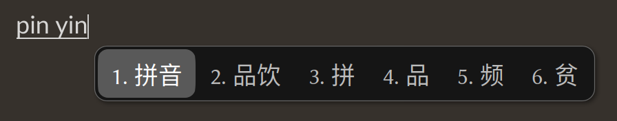

# fcitx5-mellow-themes

Aesthetic, modern fcitx5 theme featuring rounded rectangle design.


## Usage

### Manual Installation

Install for the current user: 

```
git clone https://github.com/sanweiya/fcitx5-mellow-themes.git
```

```
cd fcitx5-mellow-themes/
```

```
mkdir -p ~/.local/share/fcitx5/themes && cp -r ./mellow* ~/.local/share/fcitx5/themes
```

### Community Software Repository

#### Arch Linux

[AUR package](https://aur.archlinux.org/packages/fcitx5-mellow-themes-git) maintained by yjun.

You can use your preferred AUR helper, for example:

```
yay -S fcitx5-mellow-themes-git
```

## Screenshots

- **Youlan 釉蓝**
  
   
  
- **Sakura 灰樱**
  
   
  
- **Vermilion 朱砂**
  
   
  
- **Wechat 微言**
  
   
  
- **Graphite 石墨**
  
   
  
- **Vertical & Dual-line**
  
   

## Known Issues

- Enabling HiDPI scaling on overly modern desktop environments (eg. KDE Wayland) can result in too large margins and rounded corners on the input window.

## EOF
